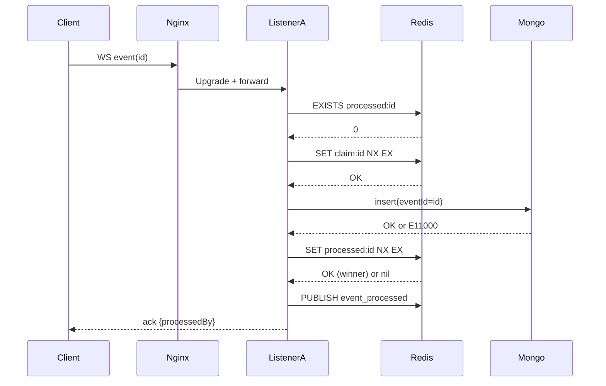

# Distributed Event Deduplication Architecture

## Components and Roles
- **Nginx**
  - Single public entrypoint on port 5000.
  - Terminates HTTP, upgrades WebSocket, and load-balances to listeners.
  - Uses `least_conn` for fairer balancing of long‑lived WS connections.
  - Passive health: `max_fails=1 fail_timeout=5s` to avoid unstable backends.

- **Listeners (listener1/2/3)**
  - Node.js Express + `ws` server; one process per container.
  - Handle inbound WS messages, run business logic, persist events.
  - Implement distributed deduplication using Redis for claims/finalization and Mongo for idempotent persistence.

- **Redis**
  - Shared coordination store for atomic claims and processed markers.
  - Pub/Sub channel (`events`) for cluster broadcast (observability/fanout).

- **MongoDB**
  - Durable persistence of processed events.
  - Unique index on `eventId` guarantees idempotent inserts.

## Where Deduplication Happens
- **Primary (Coordination): Redis keys**
  - `claim:<eventId>`: set via `SET key value NX EX <ttl>` to atomically claim processing.
  - `processed:<eventId>`: set via `SET key value NX EX 86400` to atomically finalize exactly once.
- **Secondary (Persistence): Mongo unique index**
  - `events.eventId` has a unique index. If concurrent insert races occur, only one succeeds; the other gets `E11000 duplicate key` which is handled gracefully.

## Consistency Guarantees
- **Delivery**: At‑least‑once (WS may deliver duplicates, retries, or replays).
- **Processing/Persistence**: Exactly‑once (logical‑once) at the system boundary:
  - Exactly‑one processor “wins” finalization (`processed:<id>` with NX).
  - Exactly‑one document persists due to Mongo unique index on `eventId`.

## Explicit Atomicity Reasoning
- **Atomic Claim (prevents concurrent processing start):**
  - `SET claim:<id> value NX EX <ttl>` is atomic in Redis.
  - Only the first listener acquires the claim; others skip as in‑flight duplicates.
  - The TTL provides a recovery path: if the claimer crashes/hangs, claim expires and another listener can reclaim.

- **Double‑Check After Claim (closes small race):**
  - Immediately after acquiring claim, check `processed:<id>`; if set, abort processing. This prevents finishing if another node already finalized.

- **Atomic Finalization (ensures single winner):**
  - `SET processed:<id> value NX EX 86400` makes exactly one listener the finalizer.
  - Only the winner publishes `event_processed` and sends the definitive ack.

- **Idempotent Persistence (last line of defense):**
  - Insert uses a unique index on `eventId`. If two writers reach Mongo, one succeeds, the other sees `E11000` and exits cleanly without side effects.

## Failure Modes & Recovery (Summary)
- **Crash before persist:** Claim holds others off; on TTL expiry another listener reclaims and completes. Exactly‑once ensured by `processed:<id>` NX + Mongo unique index.
- **Slow/hung worker:** Claim TTL can expire during work; overlap may occur, but only one finalizes and persists.
- **Redis outage:** Handler short‑circuits with `temporarily_unavailable` and does not process until Redis is `ready` again.
- **Mongo duplicate race:** Unique index prevents duplicates; errors are handled and do not affect finalization outcome.

### Operations Notes
- **Claim TTL tuning:**
  - Too short → unnecessary reclaims/overlap; too long → slower recovery from crashed claimers.
  - Choose TTL slightly larger than typical processing p95 if you prefer fewer overlaps; use shorter TTL to bias toward faster recovery.
- **Processed TTL window:**
  - Controls how long duplicates are short‑circuited in Redis. Longer TTL reduces load but keeps replays suppressed longer; ensure it matches your idempotency horizon.
- **Container restarts:**
  - Redis client uses retry/ready checks and auto‑resubscribe; on restart, listeners reconnect and resume. Nginx passive health avoids unstable backends temporarily.

## Scaling Considerations
- **Listeners:** Horizontal scale; coordination cost is O(1) per event in Redis.
- **Redis:** For very high throughput, consider Redis Cluster / sharding by eventId hash; keep keys short with bounded TTLs.
- **Mongo:** Ensure index on `eventId`; scale writes via sharding/replica sets; monitor write IOPS.
- **Ingress:** `least_conn` for long‑lived WS; optional `proxy_next_upstream` for transient errors.
- **Backpressure:**
  - Consider rate‑limiting or queueing (e.g., ingress rate limit or buffering layer) under extreme spikes; optionally integrate a message queue if WS bursts exceed processing capacity.

## Algorithm / Flow (Pseudocode)
```
onMessage(raw):
  msg = JSON.parse(raw)
  id  = msg.id || msg.eventId || uuid()
  processedKey = "processed:" + id
  claimKey = "claim:" + id

  if redis.status != 'ready':
    reply({status:'temporarily_unavailable', reason:'redis_down', eventId:id})
    return

  if EXISTS(processedKey):
    reply({status:'already_processed', eventId:id})
    return

  if !SET(claimKey, PORT, NX, EX, CLAIM_TTL):
    reply({status:'in_progress_elsewhere', eventId:id})
    return

  if EXISTS(processedKey):
    return  // someone just finalized

  // do work ...
  try insert event {eventId:id, ...} into Mongo
    on E11000: // duplicate key
      // already persisted elsewhere

  if SET(processedKey, PORT, NX, EX, PROCESSED_TTL):
    PUBLISH('events', {...})
    reply({status:'processed', eventId:id, processedBy:PORT})
  else:
    reply({status:'already_processed', eventId:id})

### Sequence Flow (Step List)
1. Client sends WS message with `eventId`.
2. Listener receives message and checks Redis readiness.
3. If not ready → respond `temporarily_unavailable` and exit.
4. Check `processed:<id>`; if present → respond `already_processed` and exit.
5. Atomically claim: `SET claim:<id> NX EX <CLAIM_TTL>`; if fails → respond `in_progress_elsewhere` and exit.
6. Double‑check `processed:<id>`; if present → exit silently (no side effects).
7. Execute business logic (processing).
8. Persist to Mongo; if duplicate index error `E11000`, continue.
9. Finalize: `SET processed:<id> NX EX <PROCESSED_TTL>`; if win → publish and ack; else → respond `already_processed`.
10. If the claimer dies/hangs, claim expires and another listener can reclaim at step 5.

### (Optional) Sequence Diagram


## Testing Strategy (How to Validate Dedup)
- **Duplicate flood:** many clients send the same `id` → one processed, others skipped; Mongo count=1.
- **Crash‑once recovery:** first claimer crashes pre‑persist; after TTL another listener reclaims; Mongo count=1.
- **TTL reclaim overlap:** processing > claim TTL → overlapping workers; only one finalizes/persists.
- **Redis down:** requests return `temporarily_unavailable` until Redis is ready.
- **High throughput (100+ unique):** total persisted equals total unique `id`s; distribution roughly balanced across listeners.
